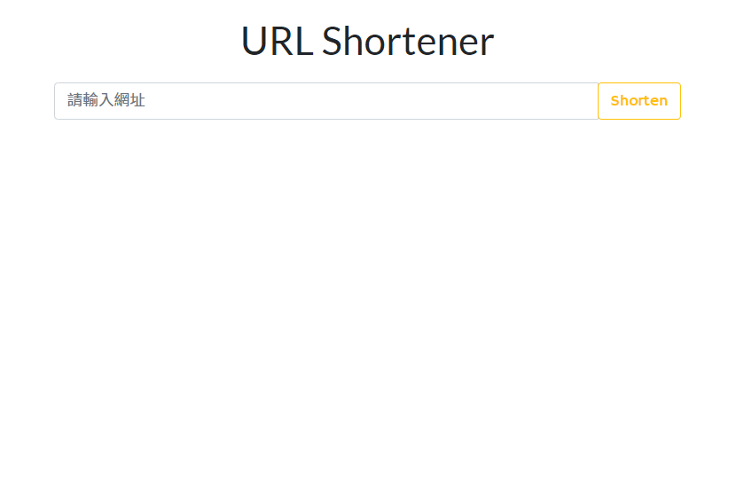
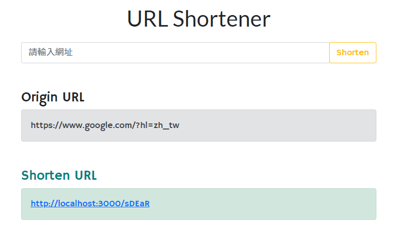
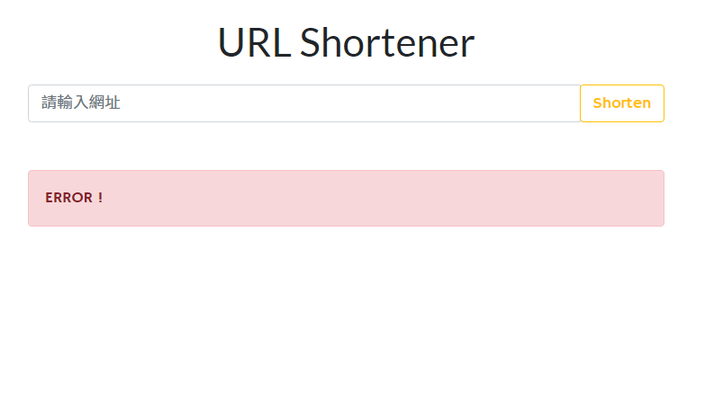

# URL Shortener
幫助縮短網址的小工具~

## Features - 產品功能
1. 使用者可以於首頁輸入任意網址
2. 點擊 shorten 按鈕後，會出現短網址
3. 使用者可以使用短網址，跳轉至使用者原先輸入的網址

### 首頁

### shortened success頁面

### error頁面
若是出現error，代表已經沒有短網址可使用

## Installing - 專案安裝流程
1. 開啟終端機，執行以下指令 :
> `git clone https://github.com/KarolChang/shorten-url.git`

2. 進入專案資料夾
> `cd shorten-url`

3. 安裝 npm & 透過 npm 安裝以下套件
> `npm install`
> `npm i express express-handlebars body-parser mongoose`

4. 安裝nodemon
> `npm install -g nodemon`

5. 啟動專案
> `nodemon app.js`
> 在瀏覽器進入 http://localhost:3000

## Environment & Tools - 環境&使用工具
* [Visual Studio Code編輯器](https://code.visualstudio.com/)
* [Node.js (v10.15.0)](https://nodejs.org/en/)
* [express框架](https://www.npmjs.com/package/express)
* [express handlebars模板引擎](https://www.npmjs.com/package/express-handlebars)
* [body-parser](https://www.npmjs.com/package/body-parser)
* [mongoose](https://www.npmjs.com/package/mongoose)